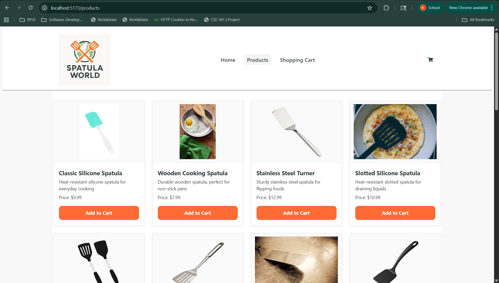
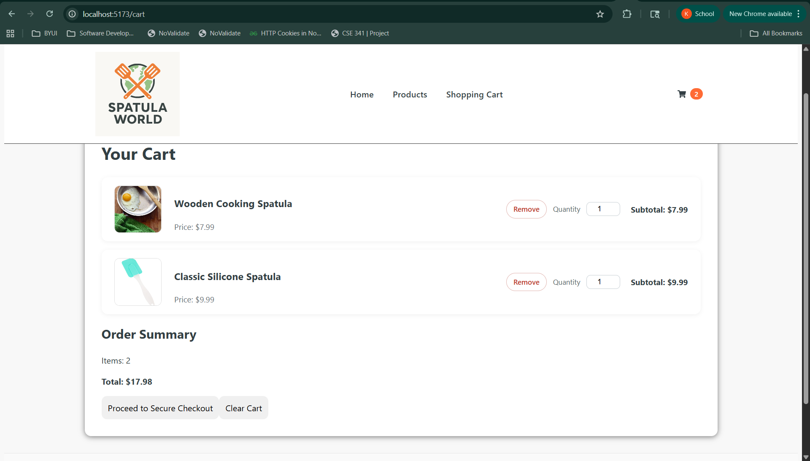
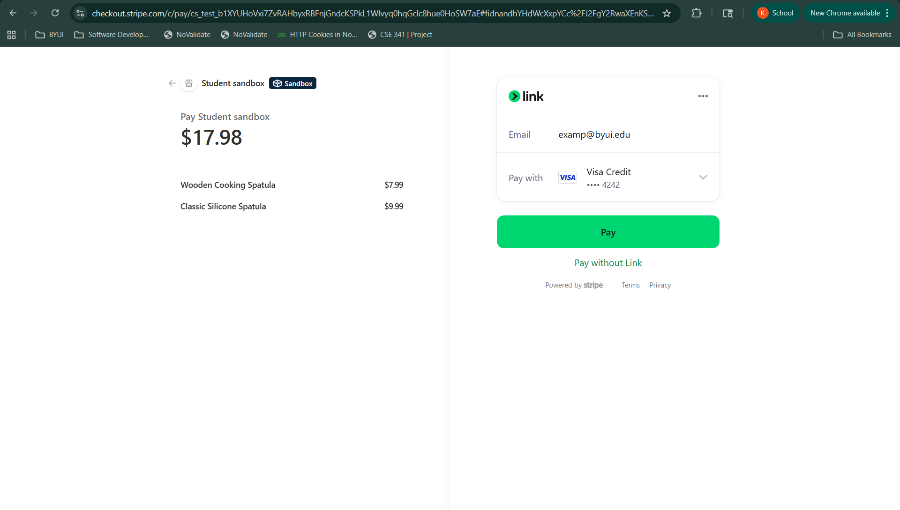

# spatula-world-ecommerce-site
# Overview
In building this project my purpose was to learn how to build a full-stack web application using React on the frontend, Node.js/Express on the backend, MongoDB for storage of the product list and in the future an orders list, and Stripe for secure payments.

This is an e-commerce app that sells spatulas. It has a products page with cards that include an image, description, and an 'Add to Cart' button. The home page has a shopping cart icon that shows the count of product in the cart and is a working link to the shopping cart page. The shopping cart page shows a list of items added to the cards with images and prices fetched from MongoDB. There is a quantity button to add more of an item on each card. There is a running subtotal in the summary section. There is a checkout button that directs the user to Stripe, a secure payment site. When payment is made and successful the user is redirected to a success checkout page. The app gets its products from a mongoDB cluster and manually seeded using a JSON file. To start the app in the terminal from the navigate to backend and type npm run dev then open another terminal and navigate to the frontend. Then type npm run dev and go to the localhost 5173.

# Screenshots
### Product Page

### Cart Page

### Checkout Page

# Architecture Overview
The flow of this project goes from the UI which is run with React -> In react axios is imported to make requests to the backend -> The backend then sends a request to fetch the products list from MongoDB 

* Frontend (React + Vite)
    * Displays the Home page, the product catalog, the shopping cart, and checkout page
    * Manages the global cart state with React Context
    * Sends API requests using Axios
    * Redirects to Stripe checkout
* Backend (Node.js + Express)
    * REST API endpoints, such as:
        * /api/products
        * /api/create-checkout-session
    * Retrieves product data from MongoDB
    * Creates Stripe checkout sessions
* Database (MongoDB)
    * Stores product list only
    * No users, roles, or admin accounts
    * Manual import through JSON seeding

The purpose for writing this software was to learn how to use the React libraries, along with Node.js, Express to create a server, MongoDB to get data, and Stripe to create a secure payment service.

Note: This application does not include user accounts, login, authentication, or admin features. All users are anonymous, and checkout is handled directly through Stripe's hosted payment flow.

[Software Demo Video](https://youtu.be/cVP6ZY3rENc)

# Web Pages
The Home page has navigation to the products page and the shopping-cart page. It has working links to instagram and facebook. The shopping cart count is dynamically created using a context. The Products page is dynamically created using data from a MongoDB cluster that was seeded. It is created using a product card component to create the layout of the card and a product list component that makes a call to the backend which fetches the data from MongoDB. Then the list is iterated through using .map to create the cards seen on the product page. The shopping-cart page shows a list of products added to the cart when the user clicks the "Add to Cart" button on the product card in the products page. The list of products on the shopping-cart page shows a smaller thumbnail picture of the product with a quantity input to add more of the product. This is done dynamically. There is also a summary page which keeps a running sub-total of items in the cart. At the bottom of the section there is a checkout button which redirects the user to a secure stripe payment site. When the payment is successful the user is redirected to a checkout success page.
# Development Environment

{Describe the tools that you used to develop the software}
Tools used for this app are:
React
Node.js
Express
Stripe
Axios
Vite
MongoDB 

The programming languages used are:
jsx
css
JavaScript

# How to Run This Project

1. Prerequisites
    Install:
    * Node.js (18+ recommended)
    * npm
    * Create a MongoDB Atlas account (or local MongoDB install)

2. Clone the Repository
    * Clone the repository from GitHub or,
    * In bash (terminal)
        * git clone https://github.com/your-username/spatula-world-ecommerce-site.git
        * cd spatula-world-ecommerce-site
3. Environmental Variables
    * Create a .env file inside backend folder.
    * .env.example
        * MONGO_URI=your-mongodb-connection-string
        * STRIPE_SECRET_KEY=your-stripe-secret-key
        * CLIENT_URL=http://localhost:5173
        * PORTAL=3000
    * Copy and rename:
        * cp backend/.env.example backend/.env
        * Fill in your actual values before running the app.
4. Install Dependencies
    * Backend
        * In bash (terminal)
        * cd backend
        * npm install
    * Frontend
        * In bash (terminal)
        * cd ../frontend
        * npm install

* Seeding the Database (Manual Import)
    The products list for this application is manually imported into MongoDB using a JSON file
    which is included in the assets folder.

    * How to Seed Products
      1. Open your MongoDB (either Atlas cluster or local MongoDB cluster)
      2. Go to Collections.
      3. Create a collection named products.
      4. Open the products.json file included in the assets folder of this project.
      5. Copy the entire JSON array.
      6. In MongoDB:
         * Click Insert Document
         * Switch to Insert Many
         * Paste the JSON data
         * Click Insert
    
# Users and Authorization
This application does not include:
    * User registration
    * Login
    * Authentication
    * Admin roles
    * Admin dashboards
No user documents or admin accounts are required for this project.

# Useful Websites
* [geekforgeeks](https://www.geeksforgeeks.org/reactjs/shopping-cart-app-using-react/)
* [react.dev](https://react.dev/learn/creating-a-react-app)
* [freecodecamp](https://www.freecodecamp.org/news/react-stripe-payments/)
* [Medium.com](https://medium.com/better-programming/how-to-use-stripe-in-react-js-c209d0541fb4)
* [AngularMinds](https://www.angularminds.com/blog/integrating-secure-payment-gateways-in-reacte)
* [YouTube](https://www.youtube.com/watch?v=v8B3CGG0KtI)
* [reddit.com](https://www.reddit.com/r/react/comments/pykwb3/fullstack_ecommerce_app_using_react_nodejs/)

# Future Work
* In the final checkout I would like to add shipping and tax to be calculated into the total.
* I would also like to add a cluster to MongoDB to post successful order information
* I would also like to make this application responsive.
* Add authentication and user accounts
* Add admin functionality for managing products list.

# What I learned from this project
* How to build a React application with reusable components
* How to use React Context to manage the global state of the application
* How to integrate Stripe's secure checkout
* How to structure documentation for clean project setup
* How to create an application using .jsx
